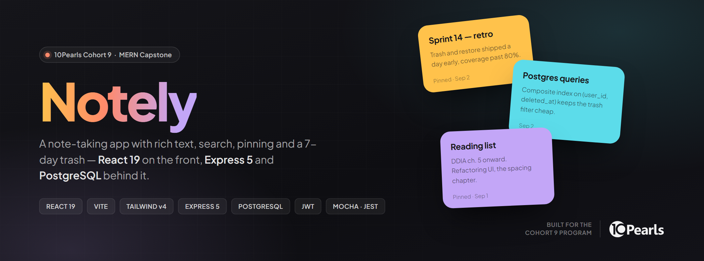
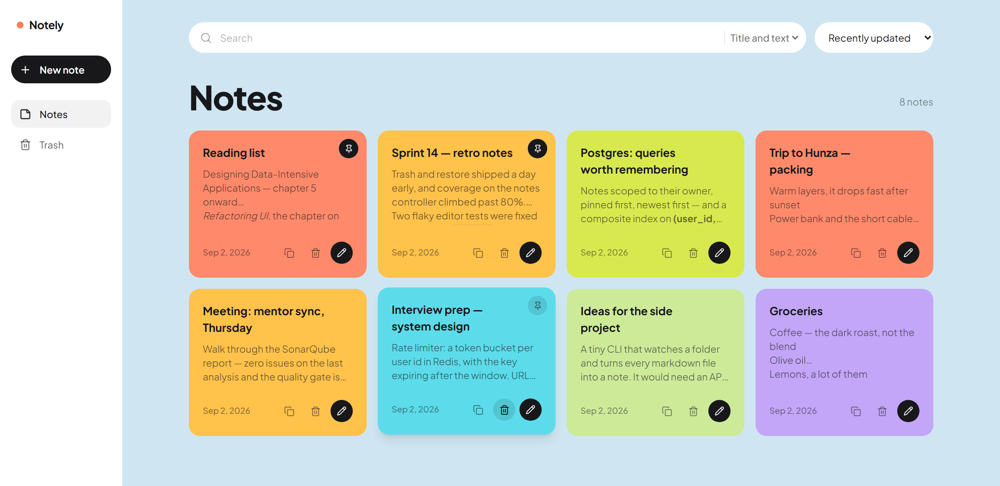
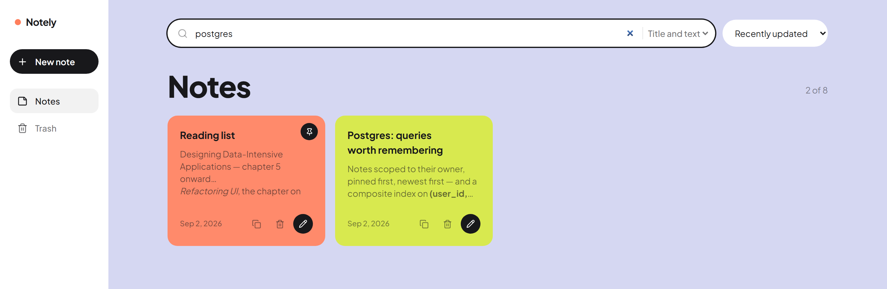
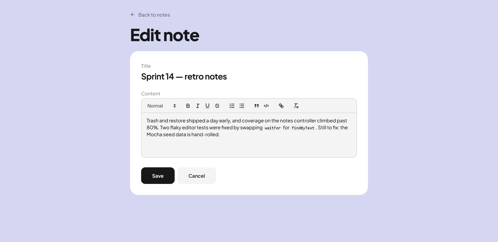
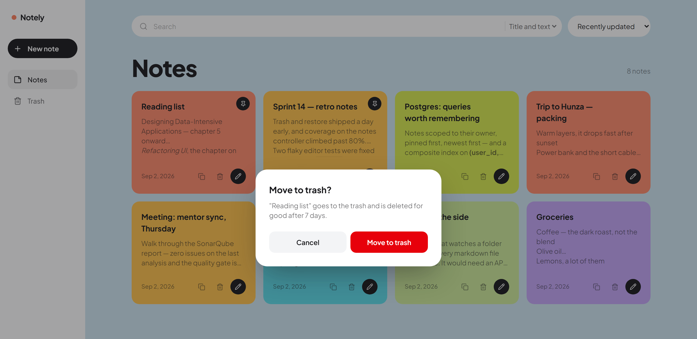
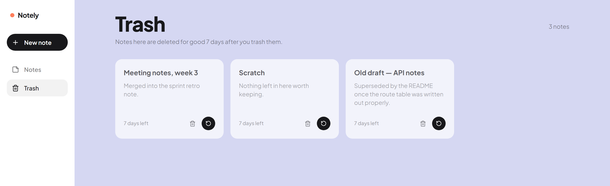
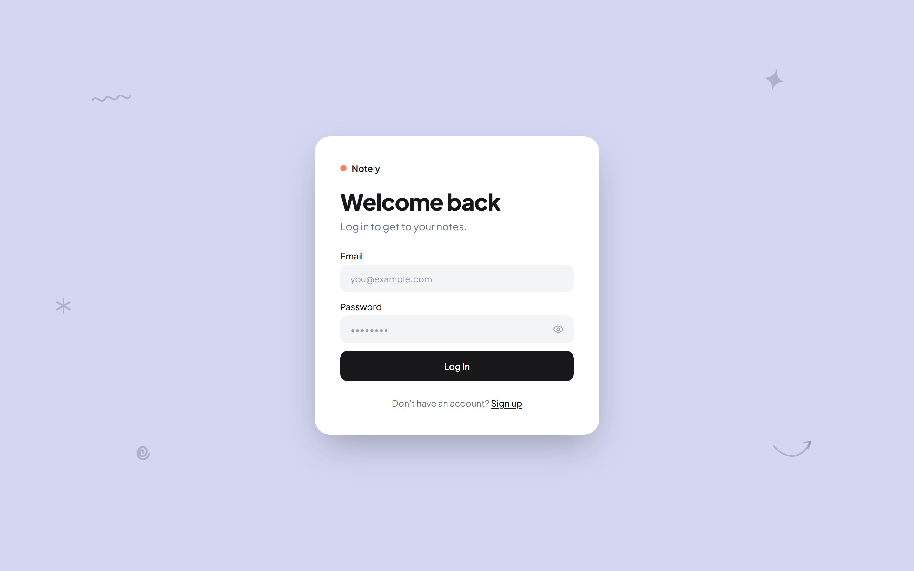
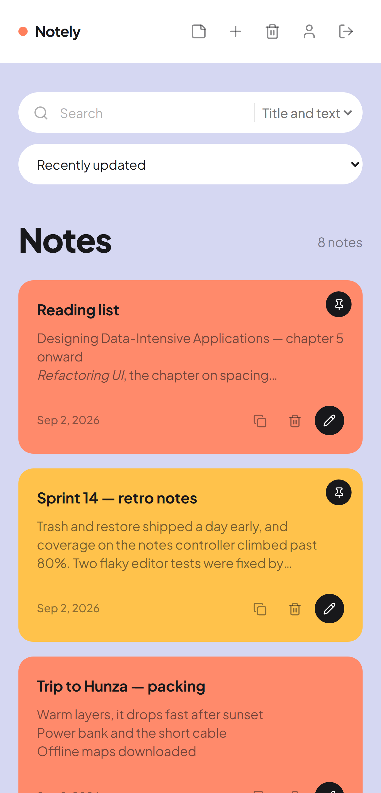
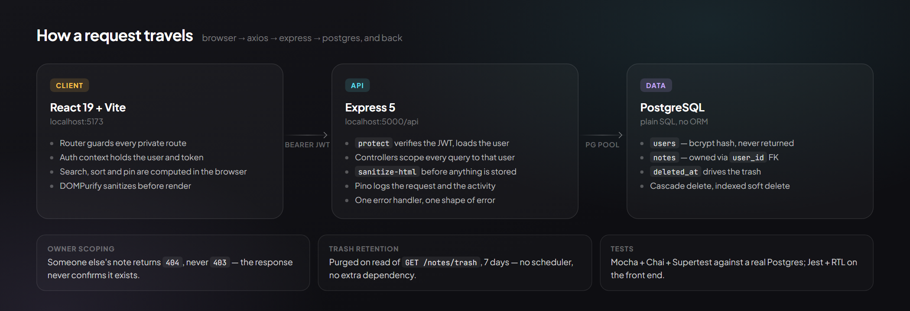
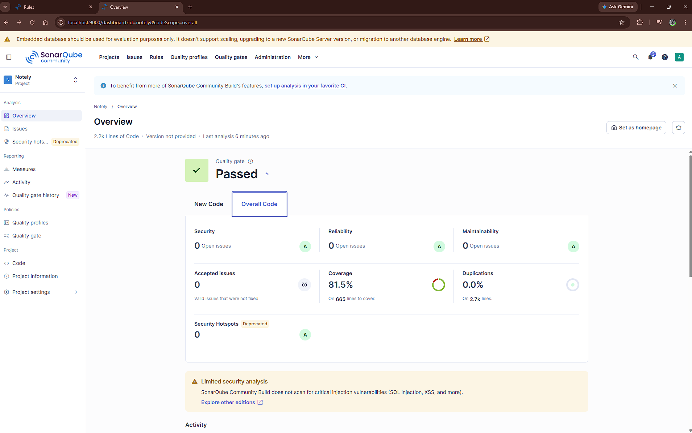

<div align="center">



<br>

<a href="#features"></a> <a href="#features"></a> <a href="#schema"></a> <a href="#tests"></a> <a href="#code-quality"></a> <a href="#code-quality"></a>

<br>

**A note-taking web app with rich text, live search, pinning and a 7-day trash.**<br>
React 19 on the front, Express 5 and PostgreSQL behind it — no ORM, plain SQL, every query scoped to its owner.

<br>

[Screens](#screens) · [Features](#features) · [Architecture](#architecture) · [Setup](#setup) · [API](#api) · [Tests](#tests) · [Code quality](#code-quality)

</div>

<br>

---

## Screens

<div align="center">

**Dashboard** — pinned notes first, page colours rerolled per session



</div>

<table>
<tr>
<td width="50%" valign="top">

**Live search**



Filter by title, text, or both. Search reads the rendered text, not the HTML — a search for `p` does not match every `<p>` tag.

</td>
<td width="50%" valign="top">

**Rich-text editor**



Headings, lists, quotes, inline code and links. <kbd>Ctrl</kbd>/<kbd>Cmd</kbd> + <kbd>S</kbd> saves; leaving with unsaved changes warns first.

</td>
</tr>
<tr>
<td width="50%" valign="top">

**Nothing is destroyed by accident**



Deleting moves a note to the trash. The dialog traps focus and hands it back when it closes.

</td>
<td width="50%" valign="top">

**Trash with a 7-day window**



Restore, or delete permanently. Anything older than 7 days is purged on the next read of the trash.

</td>
</tr>
<tr>
<td width="50%" valign="top">

**Auth that survives a refresh**



The saved token is revalidated against `/auth/me` on load, so a refresh does not log you out.

</td>
<td width="50%" valign="top">

**Responsive down to a phone**



</td>
</tr>
</table>

---

## Features

<table>
<tr><td width="33%" valign="top">

### Accounts

- Register, log in, log out
- bcrypt hashing — a password is never stored or returned in plain text
- JWT in `localStorage`, attached by an axios request interceptor
- Sessions survive a refresh
- Show/hide password toggle

</td><td width="33%" valign="top">

### Notes

- Rich text — headings, bold, italic, underline, strikethrough, lists, blockquote, inline code, links
- Every note is scoped to its owner; one user can never read or modify another's
- Sanitized twice — DOMPurify before render, `sanitize-html` before the database
- Pin, duplicate, <kbd>Ctrl</kbd>+<kbd>S</kbd> to save
- Warns before discarding unsaved changes

</td><td width="33%" valign="top">

### Finding and recovering

- Live search over title, text, or both
- Sort by recently updated, recently created, or title A–Z / Z–A
- Pinned notes stay on top regardless of the sort
- Delete moves to trash; restore or delete for good, both confirm first
- Trashed notes cannot be edited or pinned

</td></tr>
</table>

---

## Architecture



| Layer | Choice |
|---|---|
| Frontend | React 19, Vite, React Router 7, Tailwind CSS v4 |
| Editor | Quill 2 via `react-quill-new` |
| Backend | Node, Express 5 |
| Database | PostgreSQL (`pg`, no ORM) |
| Auth | JWT, `bcrypt` password hashing |
| Logging | Pino + `pino-http` |
| Backend tests | Mocha + Chai + Supertest |
| Frontend tests | Jest + React Testing Library |
| Static analysis | SonarQube Community |

Postgres rather than Mongo, and plain SQL rather than an ORM, so the schema and every query stay explicit.

---

## Setup

### Prerequisites

- Node 18 or newer
- PostgreSQL running locally

### 1. Clone and install

```bash
git clone https://github.com/10pshine-cohort-9/cohort-9-mern-11034-muhammad.git
cd cohort-9-mern-11034-muhammad

cd backend && npm install
cd ../frontend && npm install
```

### 2. Create the two databases

The app uses a separate database for tests, because the test suite truncates tables between runs and would wipe your real data otherwise.

```sql
CREATE DATABASE notes_app;
CREATE DATABASE notes_app_test;
```

### 3. Configure the backend

Copy `backend/.env.example` to `backend/.env` and fill it in:

```env
PORT=5000
NODE_ENV=development

DB_USER=postgres
DB_PASSWORD=your_password_here
DB_HOST=localhost
DB_PORT=5432
DB_NAME=notes_app
DB_NAME_TEST=notes_app_test

JWT_SECRET=some_long_random_string
JWT_EXPIRES_IN=7d

# optional, defaults to debug outside production
LOG_LEVEL=debug
```

`JWT_SECRET` is validated at startup — the server refuses to boot without it.

### 4. Create the tables

Run the schema against **both** databases:

```bash
psql -U postgres -d notes_app      -f backend/db/schema.sql
psql -U postgres -d notes_app_test -f backend/db/schema.sql
```

`schema.sql` is safe to re-run. The `CREATE TABLE` statements are `IF NOT EXISTS`, and the `ALTER TABLE ... ADD COLUMN IF NOT EXISTS` lines below them migrate a database that was created before those columns existed.

### 5. Run it

Two terminals:

```bash
# terminal 1
cd backend
npm run dev          # http://localhost:5000

# terminal 2
cd frontend
npm run dev          # http://localhost:5173
```

The frontend expects the API at `http://localhost:5000/api` (set in `frontend/src/api/client.js`).

---

## API

All `/api/notes` routes require an `Authorization: Bearer <token>` header and only ever act on notes belonging to the token's owner. A note owned by someone else returns `404`, not `403`, so the response never confirms that the note exists.

### Auth

| Method | Route | Purpose |
|---|---|---|
| `POST` | `/api/auth/register` | Create an account |
| `POST` | `/api/auth/login` | Log in, returns a JWT |
| `GET`  | `/api/auth/me` | Current user, used to restore a session |

### Notes

| Method | Route | Purpose |
|---|---|---|
| `GET` | `/api/notes` | List live notes, pinned first |
| `GET` | `/api/notes/:id` | One note |
| `POST` | `/api/notes` | Create |
| `PUT` | `/api/notes/:id` | Update title and content |
| `PATCH` | `/api/notes/:id/pin` | Pin or unpin — body `{ "is_pinned": true }` |
| `DELETE` | `/api/notes/:id` | Move to trash |

### Trash

| Method | Route | Purpose |
|---|---|---|
| `GET` | `/api/notes/trash` | List trashed notes, purging anything older than 7 days |
| `PATCH` | `/api/notes/:id/restore` | Put a note back |
| `DELETE` | `/api/notes/:id/permanent` | Delete for good |

`GET /api/notes/trash` is registered before `GET /api/notes/:id`. Express matches routes in order, so the reverse would bind `id = "trash"` and fail id validation.

---

## Schema

```text
users
  id             SERIAL PRIMARY KEY
  name           VARCHAR(100)   NOT NULL
  email          VARCHAR(255)   NOT NULL UNIQUE
  password_hash  TEXT           NOT NULL
  created_at     TIMESTAMPTZ    NOT NULL DEFAULT NOW()

notes
  id          SERIAL PRIMARY KEY
  user_id     INTEGER      NOT NULL REFERENCES users(id) ON DELETE CASCADE
  title       VARCHAR(200) NOT NULL
  content     TEXT         NOT NULL DEFAULT ''
  is_pinned   BOOLEAN      NOT NULL DEFAULT FALSE
  created_at  TIMESTAMPTZ  NOT NULL DEFAULT NOW()
  updated_at  TIMESTAMPTZ  NOT NULL DEFAULT NOW()
  deleted_at  TIMESTAMPTZ  NULL      -- NULL = live, timestamp = in the trash
```

Deleting a user cascades to their notes. `deleted_at` drives the trash: every list query filters on it, and `notes(user_id, deleted_at)` is indexed for exactly that filter.

---

## Tests

```bash
cd backend     && npm test     # Mocha + Chai + Supertest
cd ../frontend && npm test     # Jest + React Testing Library
```

| Suite | Tests | Line coverage |
|---|---|---|
| Backend — Mocha + Chai + Supertest, measured by `nyc` | 54 | 95.02% |
| Frontend — Jest + React Testing Library | 62 | 89.49% |

`npm run test:coverage` in either folder writes `coverage/lcov.info`, which is what SonarQube reads.

The backend suite hits a real Postgres database — `notes_app_test` must exist and have the schema applied. It truncates tables before each test, so never point `DB_NAME_TEST` at your development database.

---

## Code quality

Static analysis runs against the whole project on a local SonarQube Community instance. The full write-up — every finding from the first scan and what was done about it — is in **[`docs/sonarqube/`](docs/sonarqube/README.md)**.



| Metric | Value |
|---|---|
| Quality gate | **Passed** |
| Bugs / Vulnerabilities / Code smells | 0 / 0 / 0 |
| Security hotspots | 0 |
| Coverage | 81.5% |
| Duplications | 0.0% |
| Lines of code | 2,174 |

The first scan reported 2 vulnerabilities and 22 code smells. All of them were fixed, except one rule — `S6819`, prefer a native `<dialog>` — which was deliberately deactivated: `ConfirmDialog` implements its own focus trap with two tests covering it, and handing focus management to the browser would break both.

---

## Logging

Pino is wired through a single shared instance in `backend/config/logger.js`, used by both the HTTP middleware and the controllers, so everything lands in one stream with one set of redaction rules.

**What gets logged**

| Layer | Covered by |
|---|---|
| Every HTTP request and response | `pino-http` in `app.js` |
| Every unhandled exception | `req.log.error` in the global error handler |
| Server start, stop, and fatal crashes | `server.js` |
| User activities | `req.log.info` / `.warn` in the controllers |

**Activity events**

`user_registered`, `user_logged_in`, `login_failed`, `note_created`, `note_updated`, `note_trashed`, `note_restored`, `note_deleted_permanently`, `note_pin_changed`, `trash_purged`

Each line carries an `event` name plus the request id from `pino-http`, so an activity line can be traced back to the HTTP request that caused it.

**What never gets logged**

Passwords, password hashes and JWTs are never passed to the logger, and `config/logger.js` also redacts `authorization` and `cookie` headers plus any `password`, `password_hash` or `token` field as a second line of defence. Note titles and bodies are the user's private content, so only note ids are logged.

Failed logins are `warn` rather than `info` — a run of them against one email is what a brute-force attempt looks like. Permanent deletion is `warn` too, since it's the only unrecoverable action in the app.

Set `LOG_LEVEL` to override the level. Logging is disabled entirely when `NODE_ENV=test` so it doesn't bury test output.

---

## Project structure

```text
backend/
  config/db.js            postgres connection pool
  config/logger.js        the one pino instance
  controllers/            auth and notes request handlers
  middleware/             JWT protect, error handler
  routes/                 express routers
  db/schema.sql           tables, indexes, migrations
  test/                   mocha suites

frontend/src/
  api/client.js           axios instance and token interceptor
  components/             AppShell, AuthLayout, ConfirmDialog, Doodles,
                          PasswordInput, ProtectedRoute, SubmitButton, TextField
  context/                auth context and provider
  pages/                  Login, Signup, Dashboard, NoteEditor, Trash, Profile
  theme/sessionTheme.js   picks the per-session page colours

docs/
  sonarqube/              analysis report and screenshots
  assets/                 banner, architecture diagram, screenshots
```

---

## Notes on a few decisions

**Pinning sends an explicit value, not a toggle.** `PATCH /pin` takes `{ is_pinned: true|false }` rather than flipping whatever is stored. A toggle can desync from the UI if two clicks land close together.

**Pinning does not touch `updated_at`.** Pinning is not an edit, so it must not jump a note to the top of the "recently updated" sort. There is a test for this.

**The trash purges on read.** `GET /api/notes/trash` deletes anything past 7 days before selecting. That keeps the retention rule in the same code path that displays the trash, with no scheduler and no extra dependency.

**Search and sort are client side.** The dashboard already holds every note for the user, so filtering in the browser is instant and needs no extra API surface.

**Two databases.** The test suite truncates tables between tests. Sharing one database with development would delete real notes on every test run.

---

<div align="center">
<br>

Built by **Muhammad Wasiq Tanveer** for the **10Pearls Cohort 9 MERN program**.

<sub>The 10Pearls name and logo appear here only to credit the program this project was built for.</sub>

</div>
