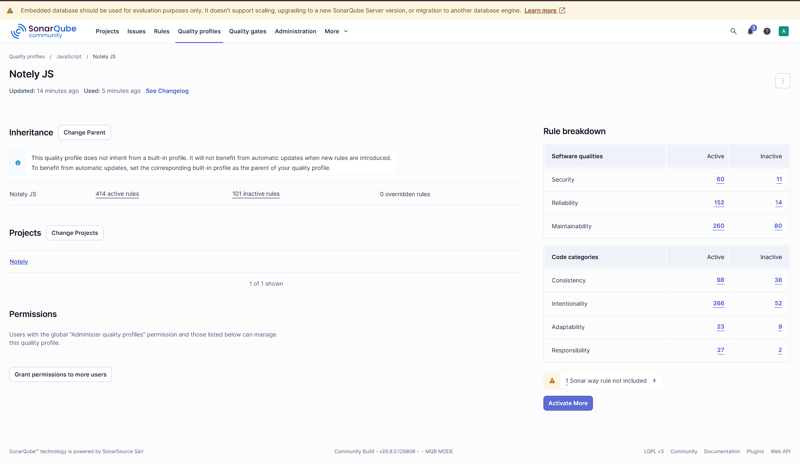

# SonarQube analysis

Static analysis was run against the whole project (backend + frontend) using a local
SonarQube Community instance.

## How it was run

SonarQube server, started with Docker:

```bash
docker run -d --name sonarqube -p 9000:9000 sonarqube:community
```

Coverage reports are generated first, because SonarQube does not run the tests itself,
it only reads the lcov files:

```bash
cd backend  && npm run test:coverage
cd frontend && npm run test:coverage
```

Then the scan, from the repo root:

```bash
docker run --rm \
  -e SONAR_HOST_URL=http://host.docker.internal:9000 \
  -e SONAR_TOKEN=<token> \
  -v "$PWD:/usr/src" \
  sonarsource/sonar-scanner-cli
```

The scanner configuration lives in `sonar-project.properties` at the repo root.
`host.docker.internal` is used instead of `localhost` because inside the scanner
container `localhost` would point at the container itself, not at the host.

## Results

| Metric | Value | Rating |
| --- | --- | --- |
| Quality gate | Passed | |
| Bugs | 0 | A |
| Vulnerabilities | 0 | A |
| Code smells | 0 | A |
| Security hotspots | 0 | |
| Coverage | 81.5% | |
| Duplications | 0.0% | |
| Lines of code | 2,174 | |


Tests behind that coverage number:

| | Tests | Line coverage |
| --- | --- | --- |
| Backend (Mocha + Chai, nyc) | 54 | 95.02% |
| Frontend (Jest + Testing Library) | 58 | 89.00% |

## What the first scan found, and what was done about it

The first run reported 2 vulnerabilities and 22 code smells. All of them were either
fixed or handled deliberately:

| Finding | Count | Action |
| --- | --- | --- |
| S2245 pseudorandom number generator | 2 | Fixed — `Math.random()` replaced with `crypto.getRandomValues()` in `sessionTheme.js` |
| S9011 missing button type | 8 | Fixed — added `type='button'`, a button with no type defaults to `submit` |
| S9020 `waitFor` with `getByText` | 8 | Fixed — replaced with `findByText` |
| S6481 context value rebuilt every render | 1 | Fixed — `useCallback` + `useMemo` in `AuthProvider` |
| S8786 regex with super-linear backtracking | 1 | Fixed — tag stripping now uses `DOMParser` instead of a regex |
| S3358 nested ternary | 1 | Fixed — extracted a `countLabel` helper |
| S7721 function defined inside a component | 1 | Fixed — `navClass` moved to module scope |
| S6582 preferred optional chaining | 1 | Fixed — in the auth middleware |
| S6819 prefer `<dialog>` over `role="dialog"` | 1 | Rule deactivated, see below |

The two `dangerouslySetInnerHTML` usages did not raise anything, because both are
wrapped in `DOMPurify.sanitize()`.

## Quality profile

The project uses a custom quality profile, `Notely JS`, copied from `Sonar way`.



One rule is deactivated in it:

**S6819 — "Prefer `<dialog>` over the `dialog` role"** (415 active rules -> 414)

`ConfirmDialog` implements its own focus trap: focus moves to the confirm button when
the dialog opens, and Tab wraps back inside instead of escaping to the page behind.
Two tests cover that behaviour. Switching to a native `<dialog>` with `showModal()`
would hand focus management to the browser and break both of them, so the rule is
turned off for this project rather than followed.

## Note on the database

The instance uses SonarQube's embedded database, which the server warns is for
evaluation only. That is the intended use here — this is a local instance used to
analyse the project, not a shared server.
